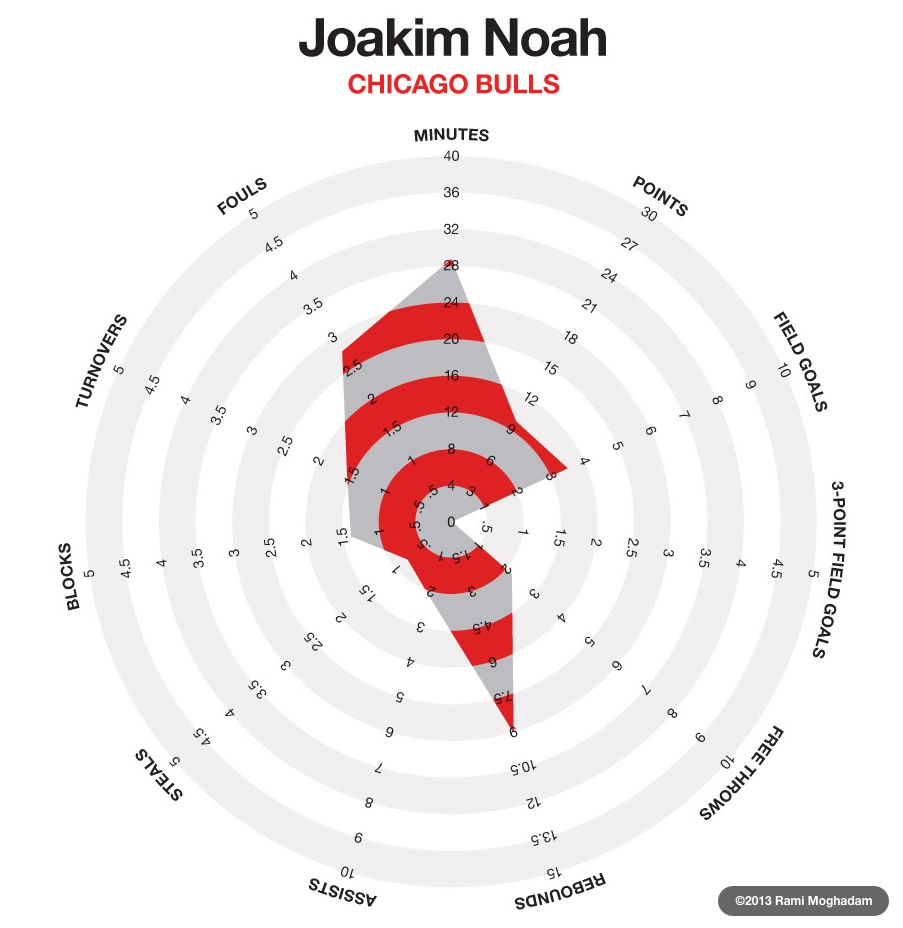

We sat around our little table, trying to express how we thought the fitting-together-and-interdependency of the six frames of the ACRL's new(-ish) [Framework for Information Literacy for Higher Education][A] changed the way we represented the relationship between our student learning objectives for information literacy and the ACRL's "recommendation". The librarians who led the development of our learning objectives had left us with a list of objectives[^f1] for each learning activity, annotated so that each objective was explicitly tied to an outcome or outcomes in the older [Information Literacy Competency Standards for Higher Education][B]. For instance,

> Students will determine if retrieved information satisfied need and will refine search if necessary.
> (2.4.a)(2.4.c)(1.4.a)

tied the learning objective to

> [2.4.a] Assesses the quantity, quality, and relevance of the search results to determine whether alternative information retrieval systems or investigative methods should be utilized

> [2.4.c] Repeats the search using the revised strategy as necessary

> [1.4.a] Reviews the initial information need to clarify, revise, or refine the question

This example is not particularly representative, as only five of the twenty-two distinct objectives were connected with three outcomes. The remaining objectives divided evenly between having one or two outcomes. In fact, because many objectives shared outcomes, only twenty-six of the standard's 87 outcomes are referenced.

All this is not to say that the librarians who developed our learning objectives missed something or didn't do their jobs, nor to suggest that our information literacy instruction was somehow incomplete. (They didn't, they did, and it wasn't.) Rather, it serves to illustrate how it was that we could so easily first attempt to represent the relationship between our learning objectives and the information literacy frames by assigning each objective to a frame.

As we discussed our learning objectives and instruction opportunities for the coming year, however, the current team of librarians increasingly articulated our dissatisfaction with this approach. In particular, we argued, the framework does a good job of expressing the interdependence of the six frames it identifies and cultivates a holistic understanding of information literacy instruction. "Students will determine if retrieved information satisfied need and will refine search if necessary." isn't just about understanding "searching as strategic exploration", it's also practicing "research as inquiry" and acknowledging that "authority is constructed and contextual".[^f2]

We started tossing out ideas: a table would get complicated fast. Venn diagrams, shaped whimsically like the Olympic rings? A hexagon? plotted how? And then, as we threw words into an image search engine to put a name to the fuzzy picture in our heads, Fritz recalled a style of chart which had been used to illustrate the stats of basketball players.[^f3]

These charts (which we took to calling radar charts, although that name is sometimes used to refer to an open line chart on a polar grid) displayed either the stats of an individual player or the cumulative stats of a team with a separate axis for each statistic arranged radially at equal intervals. When each value had been plotted on the appropriate axis, the plotted values were connected to form a closed rectilinear shape highlighted with a color fill.

For example, in February 2013, as their "infographic of the day", Fast Company [featured posters][D] (designed by [Rami Moghadam][E]) which showed the 2013 NBA All-Stars for the east and west divisions plotted[^f4] according to eleven different dimensions. (Fast Company called the charts "statistical snowflakes".) Each player has his own chart, and it's easy to see at a glance, for instance, that Joakim Noah specialized in rebounds but didn't score that many points.

Looking at this chart, one can see that the designer has attempted to include many different _kinds_ of statistics related to the player. This chart thereby illustrates the first potential shortcoming of radar charts: like bar charts or area charts, it's confusing to switch the units or scales of your axes. Particularly worrisome is the first axis counterclockwise of the top, since for that axis alone is the player better who has a _lower_, and therefore _smaller_, value.

In this case, these inconsistencies don't detract much from the power of these charts as presented: the primary use case is the comparison of one player's chart to another; provided the axes are aligned, the designer's point will be made. However, for our purposs, since the most logical use of a radar chart was to assign each of the six frames an axis?and since it was the interdependence of the frames which drove us to explore this style of chart to begin with?we had to ensure that our axes remained _comparable_ and therefore that they were given in the same units and the same scale. Easy enough. On our charts, all six axes span a linear range zero through five[^f5] and all use the same unit[^f6].

A second potential shortcoming of many radar charts is the failure to obey our symbolic spatial intuition that images or areas which are opposite one another represent things which are opposite one another, and, by consequence, images or areas which are adjacent to one another are more similar to each other than to images or areas further away.[^f7] Again, the 2013 NBA All-Stars charts illustrate this shortcoming well. 'Points' are not the opposite of either 'assists' or 'steals', nor are the latter two particularly similar to one another, which is how, in the case of someone like Dwayne Wade, the resulting chart can be a dense shape in one quadrant with spikes shooting out at irregular intervals in the other quadrants.

I found this flaw particularly frustrating as experimented with chart designs. The authors of the information literacy framework present the frames in alphabetical order, illustrating immediately that no special relationship, of similarity or of opposition, exists among the frames. We might, _prima facie_, assume that "research as inquiry" is more closely related to "searching as strategic exploration" than the others, until we read it carefully a realize that it depends on (and is dependent on) "authority is constructed and contextual" and even "information has value". To assert that underlying interdependence and then to produce a chart which implicitly opposes "research as inquiry" and "authority is constructed and contextual" remains a frustration. In this respect, a traditional area chart is probably preferable; its detractions, that one frame must be first and another last and that it still breaks the intuition that adjacency is similarity, have already been encountered in the arrangement of the framework itself.

Grant these shortcomings for the moment. What do we hope to achieve by plotting the quantified relationships between our learning objectives and the information literacy frames? The day we sat around our little table looking for a new way to visualize those relationships, we were, you will recall, captivated by the idea that "the framework...cultivates a holistic understanding of information literacy instruction". Our review of the framework that day inspired us to look for (and try to introduce, where we didn't find it) the balance and holism we thought should underpin our information literacy instruction if we saw it through the lens of the framework. A chart that visually showed the strengths and weaknesses of our objectives by mapping their support of each frame could provide theoretical confirmation or rejection of our hypothesis and provide the opportunity to review hypothetical gaps in our assignment of objectives to instruction opportunities.

[^f1]: Those librarians called these 'outcomes', a word taken directly from the Information Literacy Competency Standards. I'm not sure why we've increasingly referred to them as 'objectives', but I prefer the stronger sense of deliberation and intentionality it implies.
[^f2]: If this seems contrived, it is. We don't particularly care for the frame titles and agree that you have to read?at the very least?the first, summative paragraph of each frame in order to grasp the frames' scope. Even if you've already read them, it's dense, nuanced text?[read them again.][C]
[^f3]: Unlike the example used below, the charts of which Fritz was thinking illustrated college basketball statistics.
[^f4]: With career game averages for the regular season.
[^f5]: Actually, while the axes' range appears to start at zero, the ranking scale starts at one. This has two consequences: first, it reinforces a corollary of our assertion that the frames are interdependent, which is that if a learning objective supports a single frame, it must to _some_ extent support every frame, or be ineffective. Second, by preventing the data points from coinciding with center of the chart, it remains easy to identify the data point for each objective as we layer multiple objectives on the chart.
[^f6]: The scale is arbitrary; it was picked for its ubiquity and therefore familiarity. Likewise, we found it difficult to agree on exactly what we intended to quantify when we ranked our learning objectives with respect to the frames. Ultimately, we decided to rank to answer the question, "Does this objective promote the awareness described in this frame?", where '1' is 'barely' and '5' is 'exactly'.
[^f7]: Consider, for example, a color wheel: red and green are opposite each other and generally have opposite traits. Blue and purple, on the other hand are adjacent and generally have similar traits.

Bar charts, while eliminating the 'opposite' position, still often defy our intuition about adjacency. This may be why bar charts that lack an internally-enforced order (which can be found, for instance, in the progression of financial quarters on an earnings chart) are frequently arranged to in ascending or descending order by total quantity.

[A]: http://www.ala.org/acrl/standards/ilframework
[B]: http://www.ala.org/acrl/standards/informationliteracycompetency
[C]: http://www.ala.org/acrl/standards/ilframework#frames
[D]: http://www.fastcodesign.com/1671897/infographic-the-nbas-best-players-visualized-as-statistical-snowflakes
[E]: http://www.ramimo.com/
